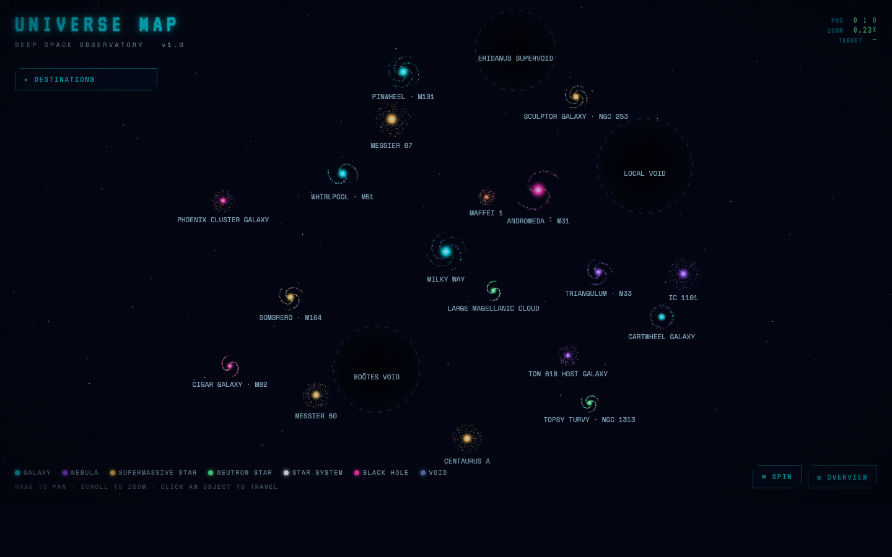
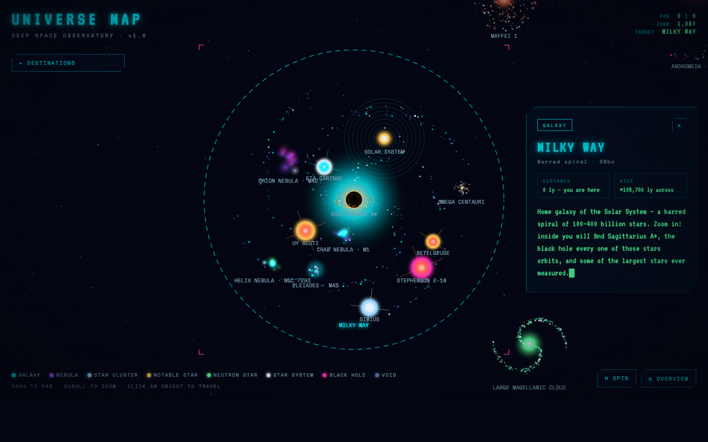
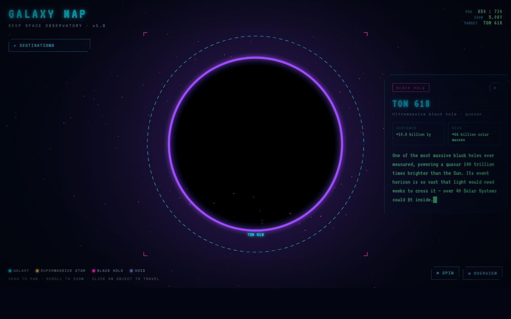
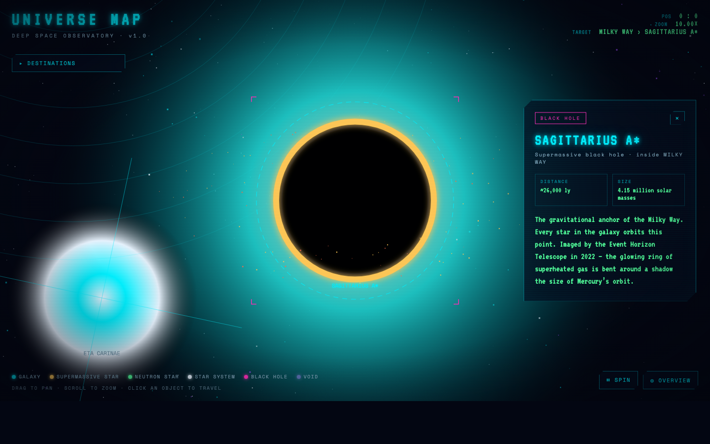

# VOIDARIUM

> **An interactive, animated deep-space observatory — a spinning universe map you can travel through.**

Voidarium is a zero-dependency universe map rendered entirely on a single `<canvas>` in vanilla HTML/CSS/JavaScript. The whole universe slowly rotates around its own axis while every spiral galaxy spins independently. Click any object to fly there with a smooth camera flight and read its story on a holographic terminal card.

  



| Inside the Milky Way | Visiting TON 618 |
|---|---|
|  |  |



## ✦ What's inside

**41 real astronomical objects across seven classes:**

| Class | Objects |
|---|---|
| 🌀 **Galaxies** (18) | Milky Way, Andromeda, Triangulum, Whirlpool, Sombrero, Pinwheel, Messier 87, Large Magellanic Cloud, Centaurus A, Cartwheel, Cigar Galaxy (M82), Topsy Turvy (NGC 1313), Sculptor Galaxy (NGC 253), Phoenix Cluster Galaxy, TON 618 Host Galaxy, IC 1101, Messier 60, Maffei 1 |
| 🟣 **Nebulae** (4) | Orion Nebula (M42), Crab Nebula (M1), Helix Nebula (NGC 7293), Tarantula Nebula (30 Doradus) |
| ⭐ **Supermassive stars** (5) | UY Scuti, Stephenson 2-18, Betelgeuse, Eta Carinae, R136a1 |
| 🟢 **Neutron stars** (3) | M82 X-2, NGC 1313 X-2, NGC 253 Magnetar |
| 🪐 **Star systems** (1) | The Solar System — the Sun and its 8 planets, orbiting inside the Milky Way |
| ⚫ **Black holes** (7) | Sagittarius A*, M87*, M31*, M104*, M60*, TON 618, Phoenix A |
| 🕳 **Cosmic voids** (3) | Boötes Void, Local Void, Eridanus Supervoid |

**Galaxies have interiors.** Stars, nebulae, neutron stars, black holes, and even our own Solar System live *inside* their real host galaxies — Sagittarius A* anchors the Milky Way, R136a1 and the Tarantula Nebula burn in the Large Magellanic Cloud, M87* hides in Messier 87, and the ultraluminous pulsar M82 X-2 spins inside the starburst Cigar Galaxy. TON 618 and Phoenix A — previously floating alone in deep space — now sit inside their real host galaxies too. Zoom into a galaxy and its residents fade into view, orbiting along with the galaxy's spin. Voids stay out in deep space, because that's what voids are: the enormous empty gaps *between* galaxies.

**Three new giant ellipticals join the map**, rendered with the same particle-based elliptical shape as Messier 87 and Centaurus A: IC 1101 (one of the largest galaxies ever found), Messier 60 (an "odd couple" with its spiral neighbor NGC 4647, and now home to its own black hole, M60*), and Maffei 1 (a giant elliptical hidden directly behind the Milky Way's own disk, only found in 1968 by looking in infrared).

**Nebulae glow like real ionized gas.** Each is a handful of soft, overlapping glow-puffs blended with additive compositing, so where two puffs overlap the color brightens instead of just layering flat — a cheap trick that reads as a roiling gas cloud instead of a static blob.

**TON 618 has two looks.** From a distance it renders as a lensed silhouette in the style of *Interstellar*'s Gargantua — a tall halo of light bent over the poles with a thin bright band where its tilted disk is seen edge-on. Click it and travel there, and it switches to the same detailed neon accretion-disk rendering every other black hole uses.

## ✦ Features

- **Own-axis rotation** — the entire map spins (toggleable), and each galaxy rotates independently with its own angular speed
- **Click-to-travel** — smooth exponential camera flights; arrival triggers the info panel
- **Level-of-detail reveal** — interior objects appear only when their host galaxy fills enough of the screen, and hidden objects can't be clicked
- **Orbit lock** — when you visit an object inside a spinning galaxy, the camera follows it around its orbit; drag or scroll to break the lock
- **Holographic info cards** — scanline-swept panels with a VT323 typewriter effect, real distances, sizes, and descriptions
- **Free navigation** — drag to pan, scroll to zoom toward the cursor, destinations drawer with the full nested catalog
- **Deep links** — `?goto=ton-618` flies to an object on load; add `&snap=1` to jump there instantly
- **Physically flavored rendering** — Keplerian accretion disks whose inner particles orbit faster and pass behind/in front of the event horizon, pulsing supergiants with diffraction spikes, sweeping lighthouse beams on neutron stars, ring and elliptical galaxy particle distributions, parallax starfield

## ✦ Running it

No build step, no dependencies. Serve the folder with any static server:

```bash
python3 -m http.server 5641
# then open http://localhost:5641
```

## ✦ Project structure

```
├── index.html          # shell: HUD, destinations nav, info panel
├── css/
│   ├── variables.css   # every color in the project — single source of truth
│   └── style.css       # neon HUD, glow effects, scanlines, responsive layout
└── js/
    ├── data.js         # galaxiesData — the object catalog (add entries here)
    └── main.js         # canvas engine: camera, rotation, renderers, travel
```

## ✦ Adding your own object

Everything is data-driven. Add one entry to `galaxiesData` in [`js/data.js`](js/data.js) and the engine, navigation list, and info panel pick it up automatically:

```js
{
  id: 'my-star', name: 'MY STAR', type: 'star',
  class: 'Red supergiant',
  parent: 'milky-way',            // lives inside a galaxy…
  local: { r: 80, a: 2.4 },       // …at this polar offset from its core
  radius: 11,
  palette: ['--star-red', '--golden-yellow'],  // CSS vars from variables.css
  spinSpeed: 0.0005,
  distance: '~1,000 ly',
  size: '~900 solar radii',
  desc: 'Your story here — typed out on the terminal card.'
}
```

Top-level objects (galaxies, lone black holes, voids) use `x, y` world coordinates instead of `parent`/`local`.

## ✦ How it works

One world, one camera. Every object lives in world coordinates; a single camera `(x, y, zoom)` plus a global rotation angle maps world → screen. Traveling is just easing the camera's target values — the render loop never special-cases "travel mode". Interior objects store polar offsets relative to their host, so galactic rotation moves everything inside for free.

---

*Part of the Cyber-Cards & Interactive Systems project — cyberpunk/neon aesthetic, Canvas over DOM, frontend strictly separated from any future backend.*
